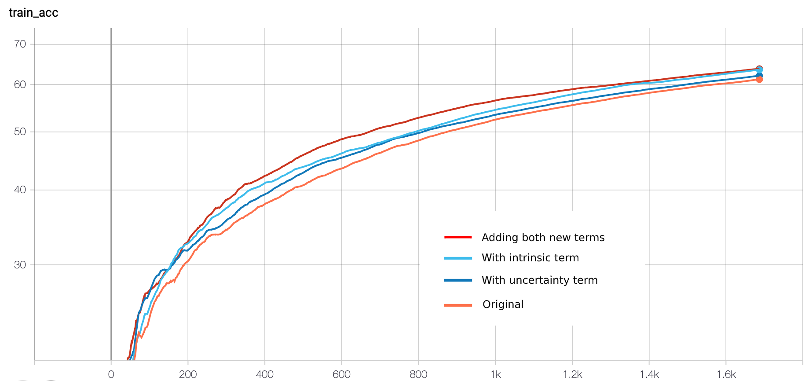
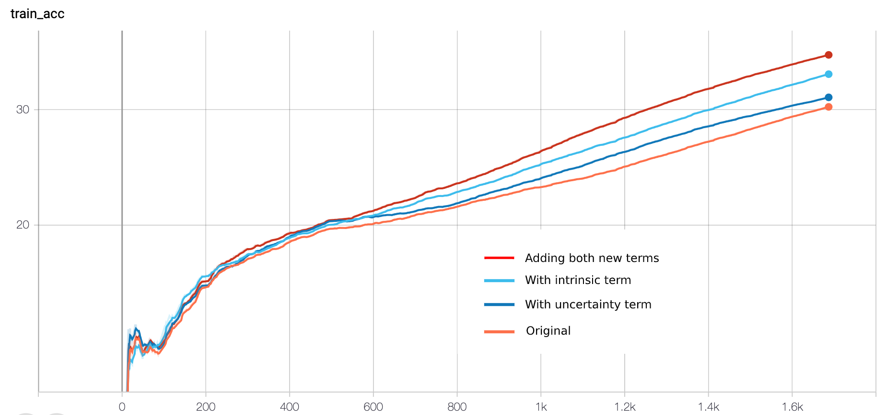
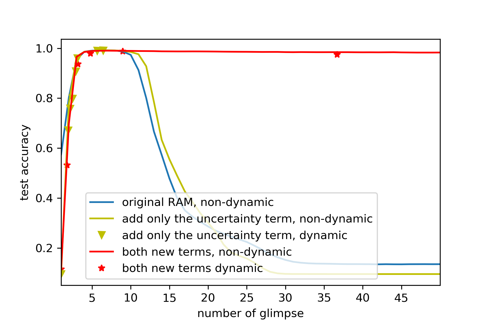

# Recurrent Visual Attention Revisited from an active information sampling perspective

This reposity contains the code and some implementation detail of the NeurIPS workshop paper < [Recurrent Visual Attention Revisited from an active information sampling perspective, Jialin Lu](https://openreview.net/forum?id=HJlVEQt8Lr) >.

## Model Description

The *Recurrent Attention Model* (RAM), instead of processing the input image for classification in full, only takes a glimpse at a small patch of the image at a time. The recurrent attention mechanism learns where to look at to obtain new information based on the internal state of the network. After a pre-defined number of glimpses, RAM finally makes a prediction as output. Compared with the attention mechanism which now dominates the AI/NLP research such as Transformer (Vaswani et al., 2017) and BERT (Devlin et al., 2018), this recurrent attention mechanism is fundamentally different, as it is used to obtain new information (active sampling of information), rather than processing information that is already fully observed.

In this paper, we (I) identify three weakness and propose to add two new objective inspired from neurosicence research, on the topic of active information sampling. It can
1. learn faster
2. enable dynamic number of glimpses without (almost) loss of accuracy (a side-effect of one of the two new objectives)
3. Generalize much better to longer sequence of glimpses that is not trained for (due to another one of two new objective )

In (Gottlieb, 2018), the authors reviewed recent studies on attentional learning, and highlighted the role of active sampling through visual attention and gaze for decision making. Particularly, Gottlieb (2018) suggested three types of motives for implementing active sampling policies,

> “ One motive relates simply to the extent to which information is expected to increase the operant rewards of a task; a second motivation is related to reducing the uncertainty of belief states; and yet a third motive may be related to the intrinsic utility or dis-utility of anticipating a positive or a negative outcome (savoring or dread). ”

In the context of RAM for classification, only the first motive is implemented by RAM as the reward of correct classification.
I model the second motive reducing of uncertainty by introducing an auxliary error network to predict the "error", and minimize this error.
The third motive is formulated as a cross entropy over a soft label -> an uniform distribution since MNIST is class-balanced.

The paper should be enough for understanding, in this repo the main point is to talk about some implementation issues.

## Caveat in replication of the original RAM

The base implementation is a clone from https://github.com/kevinzakka/recurrent-visual-attention, a **PyTorch** implementation of [Recurrent Models of Visual Attention](https://arxiv.org/abs/1406.6247) by *Volodymyr Mnih, Nicolas Heess, Alex Graves and Koray Kavukcuoglu*.

But in fact the implementation of @kevinzakka cannot really reproduce the original result, part of the reason is one specific part of stopping gradient flow is not implemented, and part because @kevinzakka uses monte carlo sampling to improve the test time performance (which is introduced by the following work of RAM).

One specific part of RAM is to stop certain gradient flows of the location network, as in this [thread](https://github.com/kevinzakka/recurrent-visual-attention/issues/12).

Another thing is the standard deviation of the location network, for 28*28 mnist with a 8*8 glimpse, a std of 0.10 gives a decent performance.

In this version, the original RAM can reach 98.3% in 100 epochs (with no monte carlo sampling to improve test-time performance, if used 99.2%) and of course, compared with other implementation on github, 100 epoch is really too small. If you wish to reproduce, train longer, and replace the epoch-learning-rate-decay (\*0.95 per epoch) to the ReduceLROnPlateau scheduler.

## Implementation Issues of new version

On the error network (which we get our self-uncertainty), the training of the loss of mimicking the error residual involves only the error network, while minimizing the self-uncertainty involves the rest part of RAM, see the last few lines of `model.py`, especially give attention to the pytorch's `detach` function. This is really the tricky part.

To control the factors for different versions, I use the learning rate decay of 0.95 per epoch. But in fact if you are not experimenting different versions (of objective function), it then makes more sense to use the `ReduceLROnPlateau` learning rate scheduler, which would give a better result. (see line 125-134 in `trainer.py`, also `scheduler.step()` also needs to change)

For the translated 60*60 MNIST, as the image becomes larger, we set the std smaller, we set to 0.03.

The new-introduced new parameters are in the first lines in `config.py`

## Results

This is the train accuracy of the first epoch on the original MNIST, with $λ_2=3e-3$ and $λ_1=1e-5$ and 8*8 glimpse scale 1. Note that the train acc is smooth because it is averaged, see the `AverageMeter` in `utils.py`.

The train accuracy of the first epoch on the tranlated non-centered MNIST (60*60), with $λ_2=3e-3$ and $λ_1=1e-5$ with 12*12 glimpse and scale of 2. See line 50-58 in `train.py`

The choice of these two lambda is to make them have a similar improve. Otherwise, since these two new objective are really hetergeneous, it would be hard to compare.

I test four cases 1) the orignal objective, 2) add the Jintrinsic, 3) add Juncertainty, 4) add both new terms. We see in Figure 1 that both of our new objective in isolation help a faster learning and together give the fastest convergence.

We test the trained models with varying number of glimpses. (We want to emphasize that the focus is not the absolute performance , but rather the generalization on more glimpses than train time.) We fisrt evaluate the non-dynamic case (fixed number for all samples). The performance of the original RAM decrease dramatically when N > 10. Adding both terms, the modified RAM does not suffer the decrease anymore even when N is large . Also, it is interesting that adding only the uncertainty term, we observe the improvement is very slight and the intrinsic term effectively stablizes the prediction accuracy given more glimpses. We also test the dynamic case by varying the exploration rate. We see that dynamic number of glimpses does not hurt the performance very much, which confirms with the hypothesis that some samples are easier to discriminate and thus need fewer glimpses.

## A retrospective thinking

The choice of $λ_1$ and $λ_2$ is really something, a $λ_2$ of 0.1 can effectively stablize the accuracy on longer sequences, even only in first epoch.

But $λ_1$ can not be too large, because the error network we use to predict the error as self-uncertainty also has a loss, and this prediction of error is in fact very noisy (especially in early stages) so if the $λ_1$ gets too large, the self-uncertainty will  **always** be zero.

The two new objectives can also to conflicting each other, that is, 1+1 is not greater than 2 but something between 1 and 2.

So you can probably see that it is the third objective (with $λ_2$) that does much of the lifting of the improvement of learning. But still, the second objective of reducing uncertainty does improve the convergence and it as a side-effect enables dynamic number of glimpses in test time.

(But we can still say that we can only learn the self-uncertainty by training the error network, but do not minimize it. Yes, it is true.)

## Requirements

- python 3.5+
- pytorch 0.3+
- tensorboard_logger
- tqdm

## Usage

To reproduce the experiments, see the `test_script.sh` and the jupyter notebook.

The easiest way to start training your RAM variant is to edit the parameters in `config.py` and run `python main.py`. To resume training, run `python main.py --resume=True`. Finally, to test a checkpoint of your model that has achieved the best validation accuracy, run `python main.py --is_train=False`. The new parameters introduced in this paper, is listed separately on the begining of `config.py`
